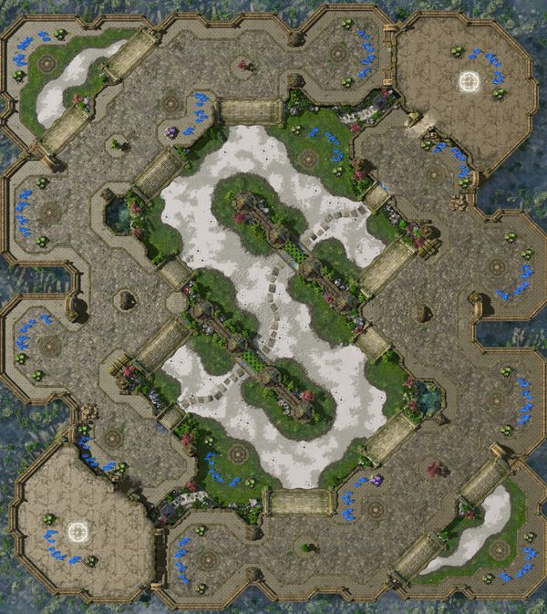
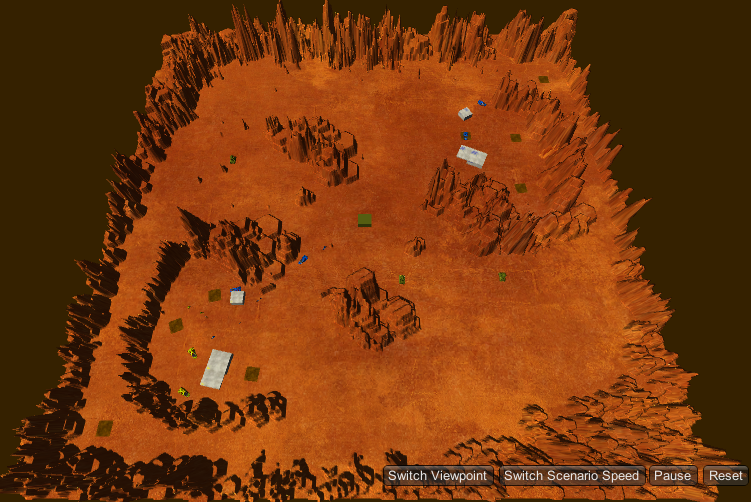

# IAV21-G07
## Introducción
Este repositorio funcionará como punto de enlace entre todas las prácticas del grupo 07 de la asignatura de Inteligencia Artifical para Videojuegos. Cada apartado se actualizará con información de las diferentes prácticas que realizaremos durante el curso. Los integrantes del grupo somos:
* Jorge Bello Martín
* Aitor García Casamayor
* David Godoy Ruiz
* Eva Lucas Leiro
* Tomás López Antón

### Práctica 1: El flautista de Hamelín

Para realizar esta práctica hemos colocado varias esferas en un espacio cuadrado, con colores diferentes según su comportamiento:
* La esfera amarilla es el jugador, y se mueve utilizando las teclas WASD o las flechas del teclado y puede tocar la flauta manteniendo la barra espaciadora, lo que cambia el suelo de color y los comportamientos del resto de esferas.
* La esfera azul es el perro, que sigue al jugador hasta que toca la flauta lo que le hace huir.
* Las esferas rojas son las ratas, que deambulan por el escenario evitándose entre sí hasta que el jugador toca la flauta, lo que provoca que vayan hacia él, evitando acabar en la misma posición que otras ratas.

Para ello hemos integrado los componentes de llegada (Llegada.cs), usados tanto en el perro como en las ratas de forma alternativa y merodeo, (Merodeo.cs) usado por las ratas cuando no suena la flauta y que tiene como padres y abuelo
los componentes encarar y alinear (Encarar.cs y Alinear.cs). Para evitar que las ratas acaben todas en la misma posición y para dar más sensación de horda hemos implementado un comportamiento de evasión (EvitarAgente.cs) que provoca
que se mantengan separadas entre sí.

Para gestionar el uso de la flauta hemos hecho un gestor para la escena (Manager.cs) que, gracias a la estructura singleton, es llamado por el jugador (desde ControlJugador.cs) para alterar el resto de objetos.

### Práctica 2: El hilo de Ariadna

Para realizar esta práctica hemos utilizado el proyecto base de Navegación. En él, a raíz de un archivo de texto codificado para formar un mapa, una vez comienza la ejecución creará dicho mapa, teniendo a Teseo en la salida y al Minotauro en el centro del mismo. Además, hemos reutilizado los scripts de movimiento de la anterior práctica.
* El caballero, que representa a Teseo, es el jugador, y se mueve utilizando las flechas del teclado y puede tocar mostrar el hilo de Ariadna manteniendo la barra espaciadora, lo que marca el camino más corto en el suelo y comienza a seguirlo, hasta que deje de pulsar el espacio.
* Si mientras se ve el hilo de Ariadna se pulsa el botón S, cambiará el camino mostrado al modo suavizado.
* El minotauro, inicialmente en el centro del escenario, merodeará de manera lenta a no ser de que en su ángulo de visión vea a Teseo.
* Existe una interfaz que muestra en todo momento el tiempo de cálculo para el camino más corto del hilo de Ariadna, el número de nodos que recorre, el estado del minotauro (merodeo-seguimiento-parado) y por último si el camino mostrado está suavizado o no.

Para ello hemos modificado ligeramente componentes que ya teníamos en el proyecto base (con el objetivo de conseguir los funcionamientos deseados), y además, hemos integrado componentes propios. Estos componentes son los siguientes:
* TeseoController: Controla la lógica del jugador, es decir, el input para cambiar el tipo del movimiento, el suavizado, etc.
* CambiarPeso: Script para aumentar el coste de las casillas adyacentes al minotauro a través de detección de colisiones.
* EvitarMuros: Modifica la dirección de los movimientos automáticos a través de lanzar raycast para evitar los muros en el movimiento.
* Minotauro: Controla la lógica del minotauro, es decir, cuando perseguir o merodear, a qué velocidad lo hace, el camino que sigue, etc.
* MirarHaciaDondeVa: Como su propio nombre indica, sirve para encarar al objeto en la dirección en la que camina.

### Práctica 3: El fantasma de la ópera
#### La cantante
La cantante comienza su estancia en el escenario cantando, lo que pone al fantasma en movimiento. Mientras no sea secuestrada sigue su rutina de ir del escenario a las bambalinas y viceversa, quedandose varios segundos al llegar a cada estancia.

Si el fantasma se acerca a ella y la captura, irá a donde vaya hasta que el fantasma la suelte ya sea por un golpe del vizconde o por haberla llevado a la celda.
Mientras sea libre intenta volver a su rutina. Merodea hasta encontrar el escenario o, en su defecto, al ver al vizconde, a quien seguirá hasta llegar a alguna de estas estancias.

Para implementar el comportamiento de la cantante hemos utilizado una máquina de estados de BOLT, que actúa siguiendo los comportamientos descritos arriba.

#### El vizconde
El vizconde es controlado por el jugador con las flechas de dirección o con WASD. Puede moverse con libertad por toda la ópera e interactuar con ciertos elementos con la tecla ESPACIO.
Este botón de interacción permite al jugador tirar las lámparas del patio de butacas al accionar la palanca correspondiente en cada palco, arreglar dichas lámparas si se encuentra cerca de ellas, golpear al fantasma para aturdirle y que suelte a la cantante si la lleva consigo.

#### El público
El público está en el patio de butacas y lo único que hace es salir de allí al vestíbulo cuando cae alguna de las dos lámparas. No vuelven al patio debutacas hasta que las lámparas estén arregladas y haya pasado un tiempo.

####  El fantasma
El fantasma viaja a las bambalinas cuando oye cantar a la cantante. Si se encuentra con ella la llevará a su celda, y si no comprobará si hay público en el escenario.
Si este es el caso tirará una de las lamparas para espantar al público, y si no irá al escenario a buscar a la cantante. Si esta no está allí el fantasma deambulará hasta encontrarla.

En el caso de que el fantasma sea atacado por el vizconde quedará aturdido por unos segundos y volverá a su sala de música, y si llevaba a la bailarina la soltará.

Para implementar el comportamiento del fantasma hemos utilizado una máquina de estados de BOLT, que actúa siguiendo los comportamientos descritos arriba.

#### El entorno
El entorno está organizado tal y como se indica en la práctica, con todas las conexiones pertinentes.

####  Las barcas
Las barcas están desarrolladas de tal forma que el jugador o el fantasma pueden ir a UNO DE LOS POSTES NEGROS y subirse a la barca que les espera allí o pueden "llamar" a la barca, lo que les hace esperar a que llegue.

Para el movimiento de las barcas del fantasma el NavMesh tiene los "saltos" puestos en los embarcaderos pero colocados de tal forma que antes de llegar a ellos el comportamiento del fantasma cambia y hace que active la barca y espere hasta llegar al destino. Para aumentar el coste de la navegación del fantasma, al subirse a una barca altera el coste del "salto" del NavMesh, pero solo cuando el fantasma lo hace, para el vizconde no cambia y la cantante no puede subir a las barcas.

####  La cámara
El jugador puede cambiar de cámara en cualquier momento usando los botones 'c', 'v', 'g', 'f'.

### Práctica 4: Dune

Para realizar esta práctica hemos utilizado el proyecto base de RTSNavegación. Este proyecto tenía toda la base del funcionamiento del juego, desde las unidades y sus movimientos hasta algún ejemplo de controlador IA. Teniendo esta base, hemos creado un escenario propio, basado en el siguiente mapa del videojuego Starcraft:

Modificando el terreno de Unity proporcionado en el proyecto base para mantener la estética, hemos colocado las dos bases en las esquinas, creando unos pasillos en la parte central como puntos calientes, además de crear unos pasillos laterales que servirán a los enemigos para atacar por sorpresa y aprovechar huecos en las filas enemigas.
A continuación, explicaremos los diferentes puntos que hemos trabajado para la realización de la práctica:
#### El mapa de influencia y la clase GraphGrid
En esta práctica hemos implementado múltiples mapa de influencia. El mapa de influencia es la representación gráfica de los "puntos calientes" del mapa, es decir, dónde se encuentran los puntos más volátiles del mapa, qué puntos domina el rival, cuáles domina nuestra ia, qué puntos tienen más unidades a su alrededor, etc. 
Para ello, hemos usado la clase GraphGrid que teníamos en la práctica 2 para representar el terreno como una cuadrícula en dos dimensiones. En lugar de utilizar un .txt como el aquella práctica, la cuadrícula la creamos dinámicamente según el escenario que tengamos en la escena. Dado que la cuadrícula siempre será la misma, pero con tamaños diferentes según el terreno, hemos eliminado todas las lecturas de archivo de la clase GraphGrid y hemos instanciado un cubo en cada posición indicada, según el tamaño de la celda.
Una vez tenemos la cuadrícula, es hora de formar los mapa de influencia. Hemos creado varias interpretaciones la clase InfluenceMap basándonos en el CookBook de Ian Millington. Cada mapa de influencia tiene unos indicadores numéricos mayores o menores según el critero de cada uno de los mapas.

El AllyMap muestra únicamente la influencia de las unidades aliadas. Esta información es usada para calcular el resto de mapas junto con el EnemyMap, que es igual pero con las unidades enemigas.
Los otros tres mapas se calculan a partir de estos y son los que aportan la información más relevanta a nuestro controlador:

El InfluenceMap resta a la influencia aliada la enemiga, lo que provoca que tenga valores inferiores en el "frente de batalla", es decir, en el punto en el que las influencias aliada y enemiga están igualadas.
El TensionMap suma ambas influencias, lo que muestra las zonas con más unidades agrupadas independientemente del bando, lo que muestra zonas seguras si la influencia es positiva (es decir aliada), o zonas de peligro si la influencia es negativa (es decir, enemiga).

Por último está el mapa más importante: el VulnerabilityMap. Se calcula con el mapa de tensión menos el valor absoluto del mapa de influencia. El resultado es un mapa de influencia que muestra con valores negativos las zonas que están dominadas por alguno de los dos ejércitos (zonas seguras si son de la influencia del jugador) y, mucho más importante, en valores altos las zonas en las que la pelea está más igualada, es decir, las zonas con mayor cantidad de tropas juntas pero con igualdad numérica entre los dos bandos. Estas zonas con valores altos son las que reciben un mayor impacto al recibir refuerzos de alguno de los dos bandos, asi que el controlador mandará a sus tropas cuando encuentre una zona de estas características

Se indicará visualmente según el color y la transparencia de cada casilla. Cuando el controlador añade una unidad, éste indica al mapa de influencia que lo ha añadido, sumando así el valor de influencia a la zona necesaria. El jugador puede cambiar entre los posibles mapas de influencia con las teclas numéricas (1-5).

#### Joaquín: nuestro controlador inteligente
Además, para utilizar las funciones del mapa de influencia, hemos creado un controlador de IA al que hemos bautizado como Joaquín. Joaquín es un jugador cuyo estilo de juego se basa en el "late-game". Se trata de una IA prudente que se centra principalmente en construir muchas extractoras al inicio de la partida para así conseguir recursos y mientras tanto defenderse para poder llevar a cabo esa tarea. Una vez conseguidos muchos recursos, Joaquín pasará al ataque, centrando así sus esfuerzos en un estilo de juego agresivo con el objetivo de acabar con todas las unidades enemigas.

Para implementar a Joaquín, hemos usado como base el RTSAIController proporcionado en la práctica. Hemos hecho modificaciones en el orden en el que realiza las acciones para que siga una lógica en la partida, basando dicha lógica también en el mapa de influencia. 

Joaquín siempre prioriza tener el máximo de unidades extractoras en todo momento para maximizar sus beneficios. Una vez llegado al límite empieza a construir unidades exploradoras hasta un máximo, y a partir de ahí se centrará única y exclusivamente en construir unidades destructoras que mantendrá en su base hasta que considere que tiene las suficientes como para mandar un ataque devastador a la base enemiga o si hay una zona con vulnerabilidad muy alta, en cuyo caso mandará a las destructoras a modo de refuerzos. Mientras construye sus destructores repartirá a sus exploradoras entre puntos aleatorios del mapa para detectar los posibles ataques enemigos.

#### Bibliografía
* Millington, I.: Artificial Intelligence for Games. CRC Press, 3rd Edition(2019)
* Palacios, J.: Unity 2018 Artificial Intelligence Cookbook. Packt Publishing, 2nd Revised edition (2018)
* Creador de mapas: https://www.dcode.fr/maze-generator
* Información acerca de mapas de influencia: http://gameschoolgems.blogspot.com/2009/12/influence-maps-i.html , https://www.gamedev.net/tutorials/programming/artificial-intelligence/the-core-mechanics-of-influence-mapping-r2799/
